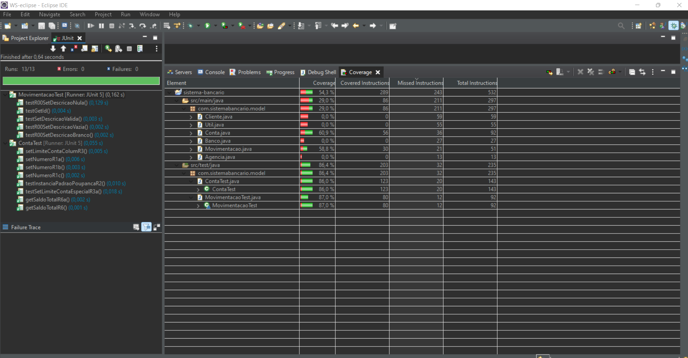

:source-highlighter: highlightjs
:numbered:
:unsafe:
:font: icons

ifdef::env-github[]
:outfilesuffix: .adoc
:caution-caption: :fire:
:important-caption: :exclamation:
:note-caption: :paperclip:
:tip-caption: :bulb:
:warning-caption: :warning:
endif::[]

= Sistema Bancário image:https://img.shields.io/github/workflow/status/Jose-742/Cobertura-de-C-digo/maven[GitHub Workflow Status]

